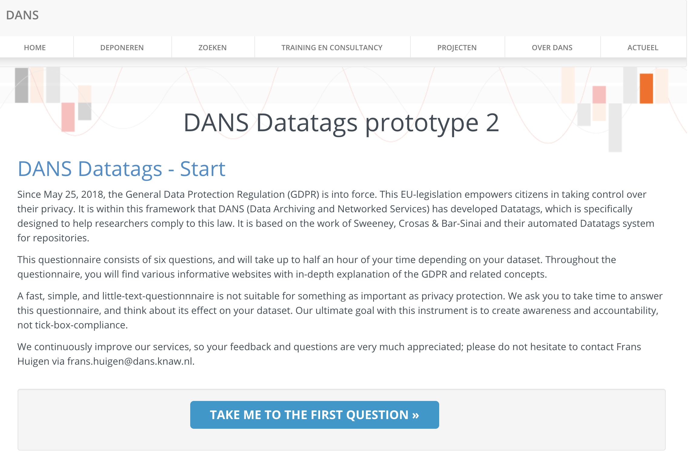

# DataTags Service

##### EOSC-Hub 

The consortium of 100 partners from more than 50 countries will develop the vision of the Hub as the integration and 
management system of the future European Open Science Cloud. It is a central contact point for European researchers and innovators 
to discover, access, use and reuse a broad spectrum of resources for advanced data-driven research. 

#### WP2

The EOSC-Hub WP2 concerns development of DataTags as a service for data support to the EOSC-hub.

## Overview

The service is developed in a generic way; therefore it can be used by any applications that support REST API.

In the sections below more details are provided about:

*	[Architecture](#datatags-architecture)
*   [Open API 3.0 Spec](https://github.com/swagger-api/swagger-core)
*   [Frameworks]()
    *   [swagger-codegen](https://github.com/swagger-api/swagger-codegen)
    *   [Spring Boot](https://spring.io/projects/spring-boot)
    *   [Spring WebFlow](https://docs.spring.io/spring-webflow/docs/current/reference/htmlsingle/)
*   [DataTags Scheme](#datatags-scheme)
    *   [DANS DataTags Scheme](#datatags-scheme-dans)
*   [DataTags Scheme Creator(GUI)](#datatags-scheme-creator)
    *   [Creating DataTags Scheme using Zinktree](https://zingtree.com/)
    *   [Creating DataTags Scheme using yEd Graph Editor](https://www.yworks.com/products/yed)
*   [Push Plugins]()
*   [Dockerizing the DataTags Service](#datatags-service-docker)
*   [Deploying, Running and Using DataTags Service on Kubernetes](#datatags-kubernetes)
*   [Connecting to DataTags Service](#datatags-dataverse)
    *   [Dataverse](#datatags-dataverse)
    *   [B2Share](#datatags-b2share)
    *	[Your own application](#datatags-apps)
*   [iRODS Rules Output](https://irods.org/)

### DataTags Architecture

### Open API 3.0 Specification

### Frameworks

### DANS DataTags Scheme

### Zinktree Visual Designer

### yEd Graph Editor

