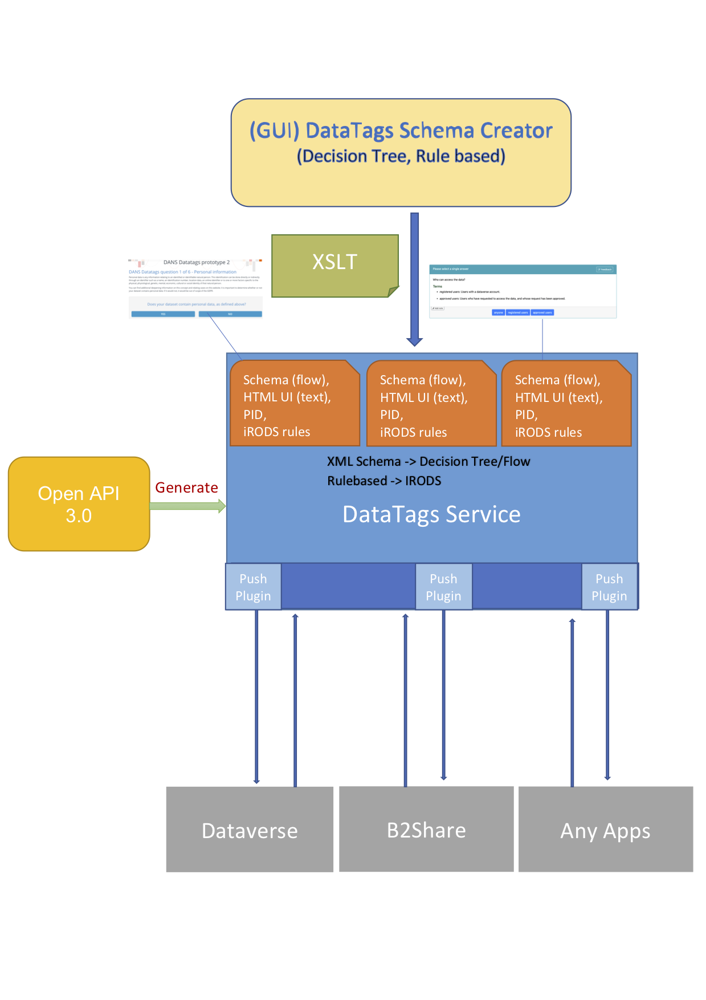
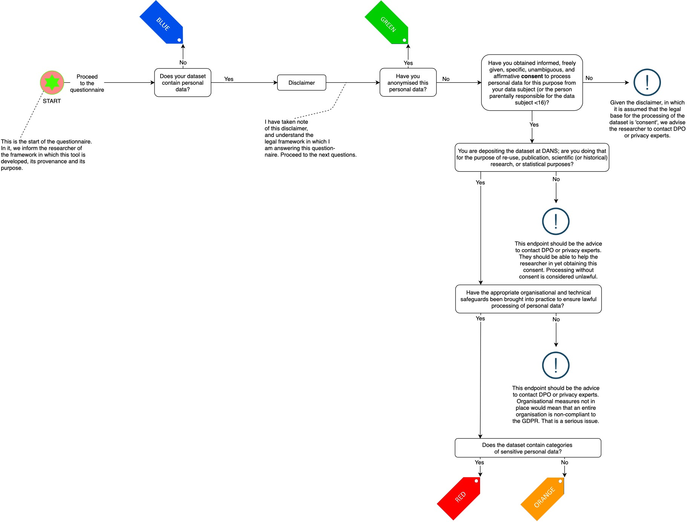
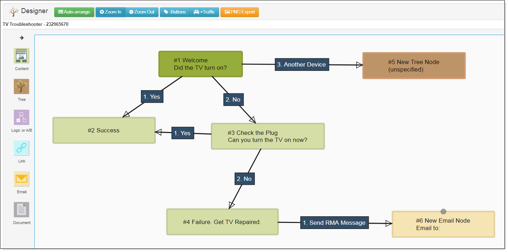
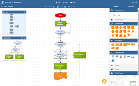

# DataTags Recommendation Service

##### EOSC-Hub 

EOSC-hub is the largest implementation project of the European Open Science Cloud (EOSC) initiative. It is a central contact point for European researchers and innovators 
to discover, access, use and reuse a broad spectrum of resources for advanced data-driven research. 

The consortium of 100 partners from more than 50 countries will develop the vision of the Hub as the integration and 
management system of the future European Open Science Cloud. EOSC-hub is the largest implementation project of the European Open Science Cloud (EOSC) initiative. 
It is a central contact point for European researchers and innovators 
to discover, access, use and reuse a broad spectrum of resources for advanced data-driven research. 

#### WP2

Within EOSC-Hub work package 2, DANS is working at an implementation of a DataTags recommendation Tool for the European General Data Protection Regulation (GDPR) 

## Overview
The service is developed in a generic way, so it can be used with different decision trees, and different repositories as long as the repository supports the use of REST API.
It receives and XML file as the result of completing the questionnaire, provenance information of the questionnaire used (including PID).
The service connects with the application of choice, and sends this information through API. 

In the sections below more details are provided about:

*	[Architecture](#datatags-architecture)
*   [Open API 3.0 Spec](#datatags-openapi)
*   [Frameworks]()
    *   [swagger-codegen](https://github.com/swagger-api/swagger-codegen)
    *   [Spring Boot](https://spring.io/projects/spring-boot)
    *   [Spring WebFlow](https://docs.spring.io/spring-webflow/docs/current/reference/htmlsingle/)
*   [DataTags Schema](#datatags-schema)
    *   [DANS DataTags Schema](#datatags-schema-dans)
*   [DataTags Schema Creator(GUI)](#datatags-schema-creator)
    *   [Creating DataTags Schema using Zinktree](https://zingtree.com/)
    *   [Creating DataTags Schema using yEd Graph Editor](https://www.yworks.com/products/yed)
*   [Push Plugins]()
*   [Dockerizing the DataTags Service](#datatags-service-docker)
*   [Deploying, Running and Using DataTags Service on Kubernetes](#datatags-kubernetes)
*   [Demo](#datatags-demo)
*   [Connecting to DataTags Service](#datatags-connection)
    *   [Dataverse](#datatags-dataverse)
    *   [B2Share](#datatags-b2share)
    *	[Your own application](#datatags-apps)
*   [Provenance](#datatags-provenance)    
*   [iRODS Rules Output](#datatags-irods)

### Architecture
The design of the Data Tags Recommendation Service is based on OpenAPI 3.0 specification, Plugins-based architecture and in a generic and reusable way.

The service uses [Spring Boot](https://spring.io/projects/spring-boot) framework that is generated from Open API 3.0 specification by using the [swagger-codegen](https://github.com/swagger-api/swagger-codegen). 
The plugins mechanism is based on the [Java reflection API](https://docs.oracle.com/javase/tutorial/reflect/) that allows [runtime type introspections](https://en.wikipedia.org/wiki/Type_introspection). This increase the flexibility and the application can be dynamically extended to include new features.

### Open API 3.0 Spec
[Open API](https://github.com/swagger-api/swagger-core) is an API Specification framework of the OpenAPI initiative. 
It is an open-source format and initiative for designing and creating machine-readable interface files that are utilized in producing, describing, consuming, and visualizing RESTful APIs and web services. 
With OAS 3.0, both humans and machines can find, view and process the dataset attributes of a REST API without access to the software and without additional documentation. 
The DataTags Recommendation Tool uses OpenAPI-Spec and the server stub is generated by the [swagger-codegen](https://github.com/swagger-api/swagger-codegen) project. 
### Frameworks
The DataTags Recommendation Service uses the following frameworks and technology:
- [Spring Boot](https://spring.io/projects/spring-boot)  
  It is an open source Java-based framework used to create a micro Service. 
- [Spring Web Flow](https://projects.spring.io/spring-webflow/)  
  It is a web framework implemented on top of Spring CoreFramework, which includes Spring MVC. 
  It is a powerful controller for the management of web application page flow.
  
- XSLT
- [iRODS](https://irods.org/)

### DANS DataTags Recommendation Schema

The Datatags Recommendation Schema supports researchers in complying with the GDPR. Through a series of such questions, the tree results in DataTags which serve as advice for compliance. This questionnaire is viewed as a tool to be used at the start of the dataset deposit process, a guide for the conversation between depositor and repository, to help determine a dataset’s content and assess any possible non-compliance issues.

### DataTags Schema Creator(GUI)
(TODO) The DataTags Recommendation Tool has planned to create a pretty nice and user-friendly DataTags schema builder to create your own flow using drag and drop.
However, you can create your own flow by using the following tools:

### Zinktree Visual Designer

### yEd Graph Editor

### Dockerizing the DataTags Service
DataTags Recommendation Service Tool has a simple ["Dockerfile"](https://docs.docker.com/reference/builder/) file format that it uses to specify the "layers" of the DataTags Recommendation Service Tool image. 
Although this Dockerfile is very simple, it is all you need to run the DataTags Recommendation Service Tool without garnish: just Java and a JAR file. 
To run DataTags Recommendation Service Tool via Docker, just type

    docker run -d -p 8888:8888 --name dtrs ekoindarto/dts:latest
    
### Kubernetes
The DataTags Recommendation Tool [DTRS kubernetes configuration](https://github.com/ekoi/datatags-service/tree/master/k8s-dtrs) uses [Træfik v2.2](https://containo.us/traefik/) as the ingress controller for your Kubernetes cluster. 
First, deploy Traefik in a daemonset and put a "DTRS" service behind it. It will also set up a certificate via Let's Encrypt. 
The manual deploy Traefik can be found [here](https://github.com/ekoi/traefik-speeltuin) 
Run the folowing command to setup the configuration:

        kubectl apply -f k8s-dtrs/
        
### Demo
Watch DataTags Recommendation Service Tool in action on [dtrs-demo.dataverse.tk](https://dtrs-demo.dataverse.tk/schema)
### Connection to DataTag Service
The following configuration has to implemented on any application that uses the DataTag Recommendation Tool.

        {
            "dataTagServiceUrl": "http://localhost:8888/dans/v1", 
            "encryptKey": "@km1-10Dec04",
            "validity-duration": 600   
        }
 
 - dataTagServiceUrl is the URL of the schema
 - encryptKey is a key that Dataverse dan DTRS use to encryp and decrypt
 - validity-duration is the number of seconds that the DTRS links is valid.
 
 #### Connection to Dataverse
 The current implementation of 
 
 ### Provenance    
 
 ### iRODS Rules Output
 (TODO) [iRODS](https://irods.org/) is a data management middleware. It uses large amounts of data along with their metadata from sources spread across multiple locations, computers and storage infrastructures.
 The iRODS Rule Engine A critical component of the iRODS system that keeps track and interprets both system- and user-defined rules. It ensures data in properly described and accounted for. 
 The DataTags Recommendation Tools will export the recommendation result as  a set of iRODS rules that can be used to enforce management policies, automate administrative functions, and validate assessment criteria. The rules are written in the iRODS rule language.